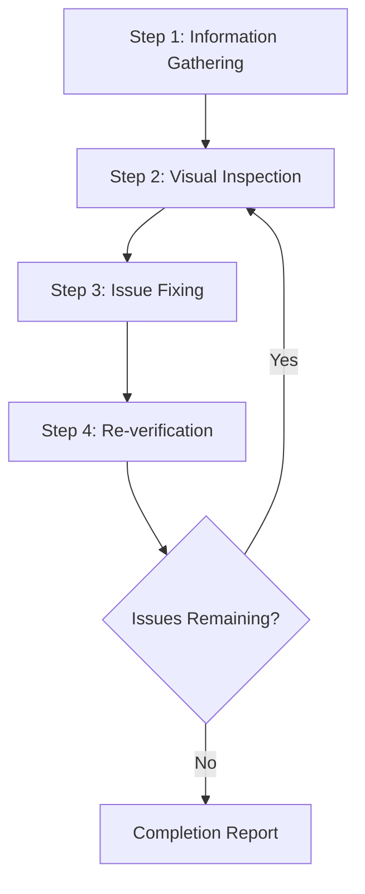

# Synthesized Imported Variant Insights

This file is synthesized from full reads of disabled overlapping skills. Treat these notes as active guidance for the keeper skill, not as an archive. Read the source folders only when this synthesis is insufficient.

Keeper: uipro-ui-ux-pro-max

## How To Apply

- Prefer the keeper skill workflow as the default path.
- Add the trigger phrases, verification checks, output contracts, and resource pointers below when they fit the task.
- If a disabled variant contains scripts, templates, references, examples, or assets, treat them as reusable resources from this keeper skill.
- Do not resurrect a disabled variant as a separate active skill unless the keeper cannot express its behavior cleanly.

## Source: claude-scholar-frontend-design

Trigger/description delta: Create distinctive, production-grade frontend interfaces with high design quality. Use this skill when the user asks to build web components, pages, artifacts, posters, or applications (examples include websites, landing pages, dashboards, React components, HTML/CSS layouts, or when styling/beautifying any web UI). Generates creative, polished code and UI design that avoids generic AI aesthetics.
Unique headings to preserve:
- Design Thinking
- Frontend Aesthetics Guidelines
Actionable imported checks:
- **Constraints**: Technical requirements (framework, performance, accessibility).

## Source: claude-scholar-ui-ux-pro-max

Trigger/description delta: This skill should be used when the user asks to design or review a UI, create a landing page or dashboard, choose colors or typography, improve accessibility, or implement polished frontend interfaces with a clear design system.
Reusable resources: data, references, scripts
Unique headings to preserve:
- UI/UX Pro Max
- Role
- Core workflow
- 1. Infer the request shape
- 2. Generate the design system first
- 3. Pull targeted guidance only when needed
- 4. Add stack-specific guidance before coding
- 5. Synthesize before implementation
- Default output shape
- Safety rules
- References
Actionable imported checks:
- UX review and remediation,
- anti-patterns to avoid.
- visual tokens,
- accessibility constraints,
- accessibility and interaction checks,
- Do not hardcode a design language without connecting it to the product type.
- Do not use emoji as primary UI iconography.
- Do not weaken text contrast for visual flair.
- Do not scale interactive cards on hover if it destabilizes layout.
- Do not use animation that violates `prefers-reduced-motion`.
- Do not invent unsupported helper scripts or datasets; use the bundled `search.py` and `data/ui-reasoning.csv` only.
Workflow excerpt to incorporate:
```text
## Core workflow
### 1. Infer the request shape
Extract the minimum design signals first:
- product type,
- industry,
- style keywords,
- target platform,
- implementation stack.
If the user does not specify a stack, default to `html-tailwind`.
```

## Source: claude-scholar-web-design-reviewer

Trigger/description delta: This skill enables visual inspection of websites running locally or remotely to identify and fix design issues. Triggers on requests like "review website design", "check the UI", "fix the layout", "find design problems". Detects issues with responsive design, accessibility, visual consistency, and layout breakage, then performs fixes at the source code level.
Reusable resources: references
Unique headings to preserve:
- Web Design Reviewer
- Scope of Application
- Prerequisites
- Required
- Workflow Overview
- 1.3 Automatic Project Detection
- 1.4 Identifying Styling Method
- Responsive Issues
- Accessibility Issues
- Visual Consistency
- 2.3 Viewport Testing (Responsive)
- Step 4: Re-verification Phase
- 4.1 Post-fix Confirmation
- 4.2 Regression Testing
- 4.3 Iteration Decision
- Detected Issues
- [P1] {Issue Title}
- [P2] {Issue Title}
- Unfixed Issues (if any)
- {Issue Title}
Actionable imported checks:
- **Target website must be running**
- Production environment (for read-only reviews)
- **Browser automation must be available**
- Screenshot capture
- Project must exist within the workspace
- Capture screenshots of fixed areas
- Compare before and after
- Verify that fixes haven't affected other areas
- **Screenshot**: Before/After
- Check dependencies in `package.json`
- Check if development server HMR is working
- Check CSS specificity issues
Workflow excerpt to incorporate:
```text
## Workflow Overview

---|------------------|
| Framework | Are you using React / Vue / Next.js, etc.? |
| Styling Method | CSS / SCSS / Tailwind / CSS-in-JS, etc. |
| Source Location | Where are style files and components located? |
| Review Scope | Specific pages only or entire site? |
```

## Source: omx-frontend-ui-ux

Trigger/description delta: Designer-developer for UI/UX work
Unique headings to preserve:
- Frontend UI/UX Command
- Usage
- Routing
- Preferred: MCP Direct
- Fallback: Codex Agent
- Capabilities
Actionable imported checks:
- Accessibility compliance
Workflow excerpt to incorporate:
```text
## Usage
```
/frontend-ui-ux <design task>
```
```

## Source: omx-visual-ralph

Trigger/description delta: Visual Ralph orchestration for frontend UI from generated references, static references, or live URL targets, using $ralph with $visual-verdict and pixel-diff evidence until the implementation matches and leaves a reproducible design system.
Reusable resources: references
Unique headings to preserve:
- Visual Ralph Skill
- Purpose
- Use when
- Do not use when
- Workflow
- 1. Ground the target repo
- 2. Establish the visual reference
- 3. Require explicit user approval
- 4. Hand off to `$ralph` for implementation
- 5. Use `$visual-verdict` before every next edit
- 6. Use pixel diff only as secondary debug evidence
- 7. Build a reproducible design system
- Completion checklist
- Handoff template
Actionable imported checks:
- The final result should leave reusable design tokens/components, not only a one-off screenshot match.
- The requested output is a deterministic SVG/vector/code-native asset rather than a raster reference.
- styling system and design-token conventions,
- screenshot/test tooling,
- existing components that should be reused.
- viewport(s), route/state, and any seed/login assumptions,
- captured baseline screenshot path or documented capture command/tool,
- include viewport/aspect ratio and intended surface,
- ask imagegen to avoid impossible UI details or unreadable text.
- do not start frontend implementation,
- do not invoke `$ralph`,
- do not treat a rough image as final.
- source URL, viewport(s), content state, and interaction parity notes for live URL tasks,
- exact screenshot command/viewport requirements,
- the completion checklist below.
- Capture the current generated screenshot with recorded viewport/state.
- Run `$visual-verdict` comparing the approved reference and generated screenshot.
- Rerun before the next edit.
Workflow excerpt to incorporate:
```text
## Workflow
### 1. Ground the target repo
Before stack-specific choices, inspect local evidence:
- package manager and scripts,
- frontend framework and routing structure,
- styling system and design-token conventions,
- screenshot/test tooling,
- existing components that should be reused.
Do not hardcode React, Vue, Tailwind, Playwright, or any other stack unless the repository evidence supports it.
```
Verification/output excerpt to incorporate:
```text
## Completion checklist
Do not declare done until all are true:
- Approved reference image or URL-derived reference artifact is saved in the workspace.
- Screenshot reproduction command, viewport, route, seed/state, and output paths are documented.
- `$visual-verdict` final score is `>= 90` against the approved reference.
- Pixel diff or overlay evidence is recorded as secondary debug evidence.
- Design-system tokens/components are repo-native and reusable.
- Build/lint/test or the repo's equivalent verification passes.
- No unapproved major design pivot occurred after reference approval.
- Remaining visual differences, if any, are explicitly documented with rationale.
```

## Source: omx-visual-verdict

Trigger/description delta: Structured visual QA verdict for screenshot-to-reference comparisons
Reusable resources: references
Actionable imported checks:
- You have a generated screenshot and at least one reference image
- You need deterministic pass/fail guidance before continuing edits
- `generated_screenshot` (current output image)
- `category_match`: `true` when the generated screenshot matches the intended UI category/style
- If `score < 90`, continue editing and rerun `$visual-verdict` before any further code edits in the next iteration.
